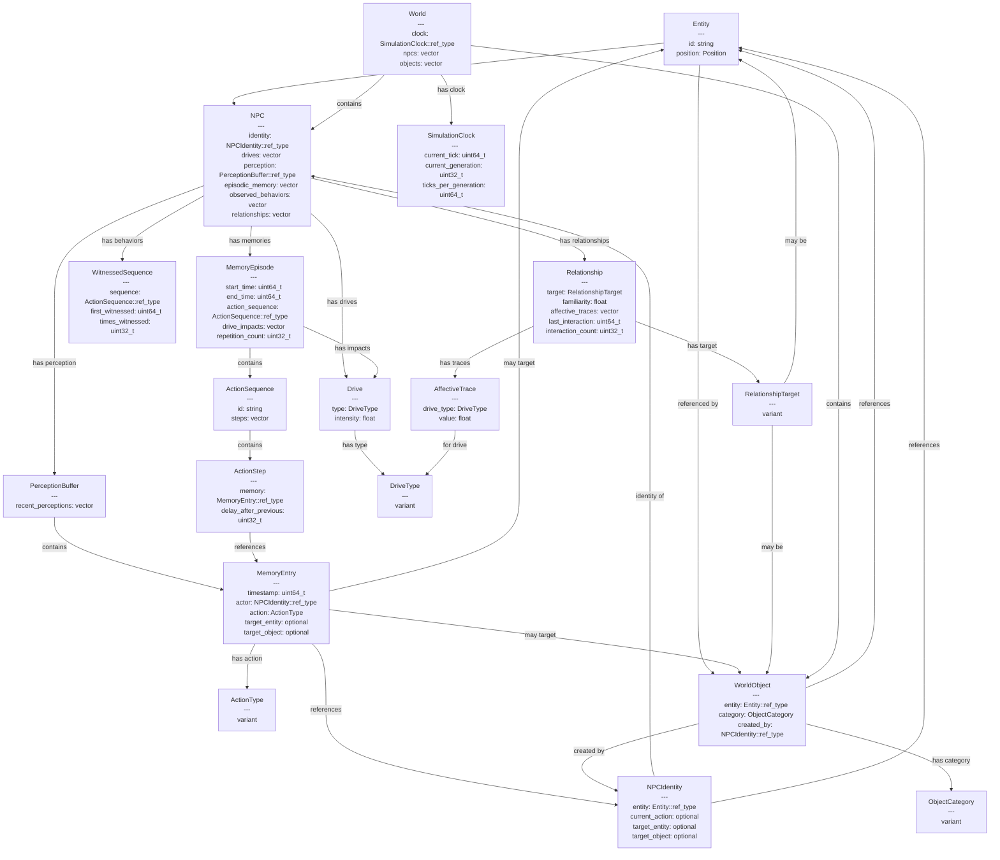

# System Architecture

## Entity Relationship Diagram

The diagram below shows the key entities in the history-game system and their relationships:

## Key Systems

The history-game consists of several interconnected systems:

1. **Entity System**: The foundation for all game objects with identity and position.

2. **NPC System**: Representing the characters that inhabit the world, with drives, memories, and relationships.

3. **Memory System**: Handles perception, memory formation, and episodic memory creation.

4. **Drive System**: Manages the emotional drives that motivate NPC behavior.

5. **Relationship System**: Tracks how NPCs relate to other entities, objects, and locations.

6. **Action System**: Defines the possible actions NPCs can take and their impacts.

7. **World System**: Manages the overall simulation state, including time progression.

## Design Principles

1. **Immutable Data**: All entities are immutable. Updates create new instances rather than modifying existing ones.

2. **Component-Based Design**: Clear separation of concerns with well-defined component boundaries.

3. **Strong Typing**: Uses strong types with variants instead of enums for type safety.

4. **Memory Safety**: Managed entity pattern for reference counting and memory management.